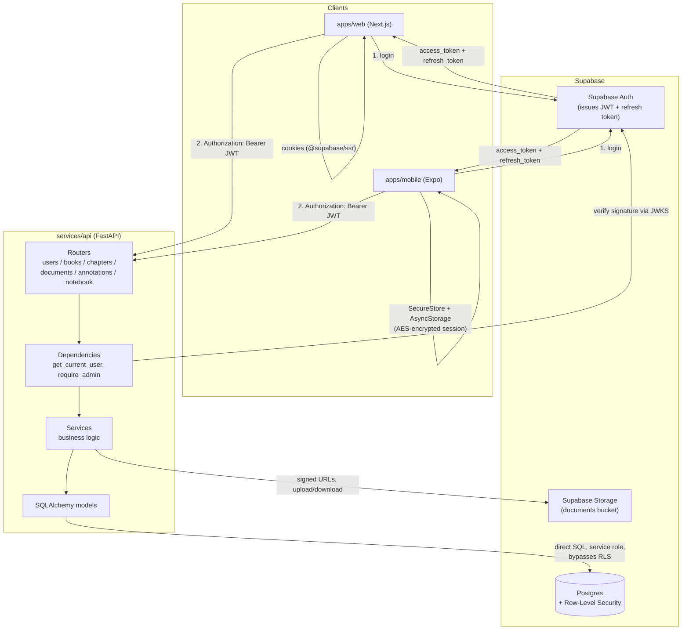
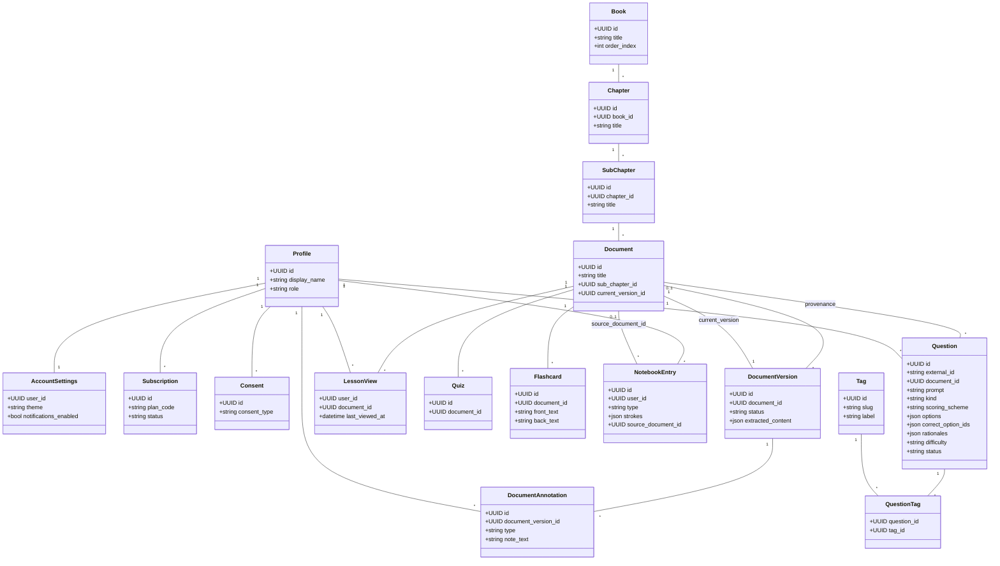

# LearningPlatform

Cross-platform learning and study application. See [`PLAN.md`](./PLAN.md) for
the full architecture, and `PLAN.md §3` for the repository layout this
monorepo follows.

## Prerequisites

- Node.js 22 (LTS) — via [nvm](https://github.com/nvm-sh/nvm): `nvm use`
- pnpm — managed via Corepack, pinned in the root `package.json`
  (`packageManager` field): `corepack enable`
- Python 3.12 — via [uv](https://docs.astral.sh/uv/): `uv python install 3.12`
- [uv](https://docs.astral.sh/uv/) for the FastAPI backend

## Quickstart

```bash
# Install JS/TS dependencies for the whole workspace
pnpm install

# Web app (Next.js)
pnpm dev:web

# Mobile app (Expo)
pnpm dev:mobile

# Backend API (FastAPI)
cd services/api
uv sync
uv run uvicorn app.main:app --reload
```

## Repository layout

```text
apps/       Next.js web app and Expo mobile app
packages/   Shared TypeScript packages (contracts, validation, domain types, UI, config, test utils)
services/   FastAPI backend
infra/      Supabase config, deployment, environment docs
docs/       Architecture, API, and operations documentation
```

## Common scripts

Run from the repo root:

```bash
pnpm lint         # lint all workspaces
pnpm typecheck    # typecheck all workspaces
pnpm test         # unit/component tests across all workspaces
pnpm test:e2e     # Playwright end-to-end tests for apps/web
pnpm build        # build all workspaces
```

For `services/api`, run the equivalent checks with `uv`:

```bash
cd services/api
uv run ruff check .
uv run ruff format --check .
uv run mypy app
uv run pytest -q
```

## Architecture

### Request flow

Web and mobile both authenticate against Supabase directly, then call the
FastAPI backend with the resulting JWT. The backend verifies that JWT against
Supabase's public keys (no shared secret, no DB lookup needed to authenticate)
and talks to Postgres/Storage directly for everything else.



### Data model

Core domain entities and how they relate. `Profile` is the app-owned mirror
of a Supabase `auth.users` row, created lazily on a user's first authenticated
request rather than via a DB trigger.


