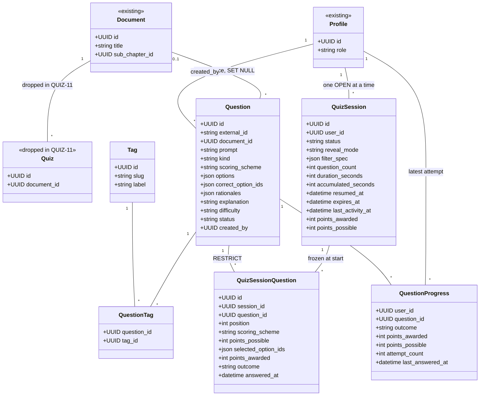
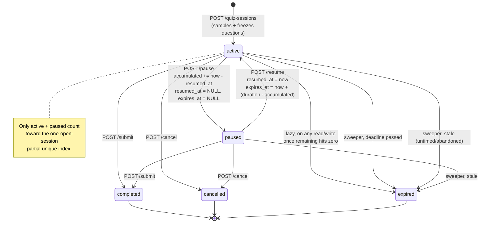
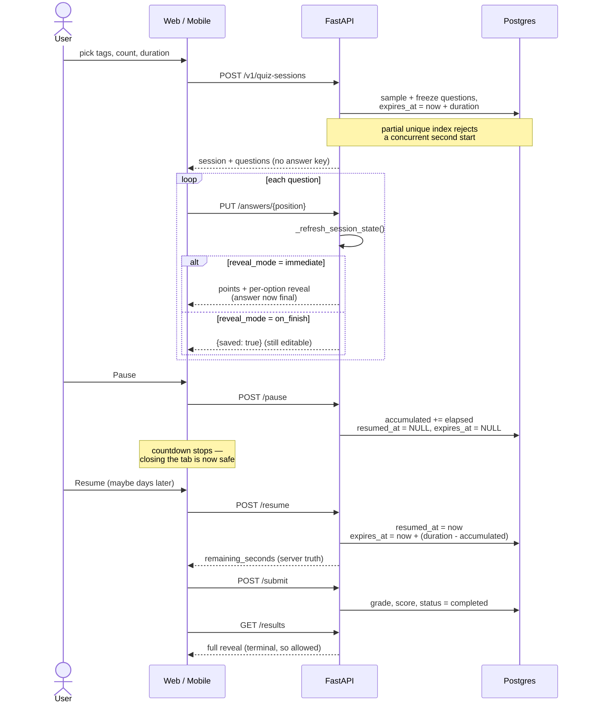

# Quizzes — question bank and quiz sessions

Status: **accepted, not yet implemented**
Supersedes: the "needs its own product conversation" deferral recorded in `TASKS_SPLIT.md` (§ Quizzes / Diagrams)
Tickets: **QUIZ-1 … QUIZ-11** in `TASKS_SPLIT.md`

Read in order. §1–4 are context, §5–7 are the contract, §8–10 are the rules, §11 is the build order. Everything in §5–10 is a decision that has exactly one right answer — take it as written rather than re-deriving it.

---

## 1. Why this document exists

`TASKS_SPLIT.md` deferred quizzes three separate times, always for the same reason: the question shape and grading model were never decided. The artefacts of that deferral are still in the tree — `services/api/app/documents/models.py` defines a `Quiz` shell table whose docstring reads _"Shell record only — no question sub-schema yet, that's still a product-undecided future pass"_, `GET /v1/documents/{id}/quizzes` always returns `[]`, and `/learn/quizzes` renders "Coming soon." on both web and mobile.

This document records the decision and the design that follows from it.

## 2. The core idea

**A per-lesson quiz and a custom quiz are the same query with different filters.**

```
per-lesson quiz    → {document_ids: [thisLesson], count: N}
custom quiz        → {tag_ids: [a, b],            count: N}
custom, unfiltered → {                            count: N}   -- the whole bank
```

One sampling function, one session runner, two entry points in the UI. Everything below follows from treating the question — not the quiz — as the atomic unit.

## 3. Decisions

| Decision                 | Choice                                                                  |
| ------------------------ | ----------------------------------------------------------------------- |
| Answer storage           | Split JSON columns — `options` never contains the answer key            |
| Existing `quizzes` table | Dropped; the lesson tab becomes "Start a quiz on this lesson"           |
| Reveal timing            | Per-session `reveal_mode`: `immediate` (practice) / `on_finish` (exam)  |
| Tags                     | Normalised `tags` + `question_tags` join, not a JSON array              |
| Grading                  | Pluggable scoring schemes; per-option marking for multi, partial credit |
| Progress                 | Per-question projection, latest attempt wins; excludes mock exams       |
| Platforms                | Web and mobile together, matching the existing epic rhythm              |
| Rollout                  | `feat/question-bank` merges first, then `feat/quiz-sessions`            |

## 4. Constraints this design has to respect

These rule out several otherwise-obvious choices, and are the reason some of the decisions above look unusual:

- **Backend tests build the schema from `Base.metadata` into in-memory SQLite** (`services/api/tests/conftest.py`), never via Alembic. So no `JSONB`, no Postgres `ARRAY`, no PG enums. Use generic `sa.JSON()` — the established precedent is `notebook_entries.strokes`. This is why tags are a join table rather than `tags text[]`.
- **A new model is invisible to both the test suite and Alembic autogenerate** unless it is imported _and_ listed in `__all__` in `services/api/app/db/models.py`.
- **There is no background job infrastructure** — no Celery, no APScheduler, not even FastAPI `BackgroundTasks`. PDF extraction runs inline in the request.
- **No RLS on application tables.** The API connects as service role and bypasses it; all authorisation is Python-side in the service layer.
- **Every migration since `07f6e847d3b9` carries a JSONB-drift comment block**, because `document_versions.extracted_content` is live JSONB while the model declares generic `JSON`, so autogenerate proposes a spurious `alter_column` every time.
- **`mypy --strict` runs on `app/`** and `ruff format --check` is a hard CI gate.

---

## 5. Data model

House conventions throughout: `Mapped[uuid.UUID]` PK with Python-side `default=uuid.uuid4`, `DateTime(timezone=True)` with `server_default=func.now()`, FKs to `profiles.id` with `ondelete="CASCADE"`.

Tables already in the schema carry an `<<existing>>` stereotype; everything else is new. `Quiz` is the one table this feature removes.



The two edges carrying the design are `Profile → QuizSession` (many over time, exactly one in an open state) and `QuizSession → QuizSessionQuestion` (the frozen, ordered draw).

**`QuizSession`'s primary key is its own UUID, not the user's.** Keying it on `user_id` — the pattern `account_settings` uses, which is correct there because a profile has exactly one settings row forever — would permit only one session per user _in all of history_, destroying every past attempt on the next start. Sessions are one-per-user only among _open_ ones, and that is a partial unique index, not a primary key.

### 5.1 `questions` — the bank

| Column                      | Type                     | Notes                                                                                   |
| --------------------------- | ------------------------ | --------------------------------------------------------------------------------------- |
| `id`                        | Uuid                     | PK                                                                                      |
| `external_id`               | String, unique, nullable | Stable key for idempotent re-import                                                     |
| `document_id`               | Uuid, nullable           | FK → `documents.id` `ON DELETE SET NULL`; lesson provenance                             |
| `prompt`                    | String                   | The question stem                                                                       |
| `kind`                      | String                   | `single` \| `multi`                                                                     |
| `scoring_scheme`            | String                   | Registry key — `single_4` \| `multi_5_per_option` (§6.3)                                |
| `options`                   | JSON                     | `[{"id": "a", "text": "..."}]` — safe to return verbatim                                |
| `correct_option_ids`        | JSON                     | `["a", "c"]`                                                                            |
| `rationales`                | JSON                     | `{"a": "right because...", "b": "wrong because..."}`                                    |
| `explanation`               | String, nullable         | Overall rationale                                                                       |
| `difficulty`                | String                   | `easy` \| `medium` \| `hard`, default `medium`. **Write-only in v1** — no filter, no UI |
| `status`                    | String                   | `draft` \| `published` \| `archived`, default `draft`                                   |
| `created_by`                | Uuid                     | FK → `profiles.id`                                                                      |
| `created_at` / `updated_at` | DateTime(tz)             |                                                                                         |

**The split-column shape is the security property.** Returning `options` cannot leak the answer key, so the naive read path is already correct — there is no `QuestionPublic` / `QuestionReveal` pair that has to be kept in sync, and no way for a forgotten response model to ship answers to the browser mid-quiz.

Closed sets live as `StrEnum` in `constants.py` and `Literal[...]` in schemas, following `app/annotations/constants.py`. Questions are never hard-deleted once published — `DELETE` sets `status='archived'`, so in-flight and historical sessions still resolve their FK.

### 5.2 `tags` + `question_tags` — the filter axis

`tags`: `id`, `slug` (unique), `label`, `created_at`.
`question_tags`: `question_id`, `tag_id`, composite PK, both `ON DELETE CASCADE`, **plus a second index in the opposite column order**:

```python
Index("ix_question_tags_tag_id_question_id", "tag_id", "question_id")
```

The PK `(question_id, tag_id)` serves "what tags does this question have". The sampling subquery asks the opposite — "which questions carry any of these tags" — and filters on `tag_id`, the PK's _second_ column. A btree cannot do an efficient lookup on a non-leading column, so without this index Postgres scans the whole PK index instead of seeking. With it, the subquery is an **index-only scan**: both columns it needs live in the index, so it never touches the table. This is the standard junction-table pair and it matters more than any rewrite of the query itself.

Normalised rather than a JSON array on the question, because the filter UI needs a canonical tag list with per-tag counts, and because a typo'd free-text tag would silently fragment that list. If a second tagging domain ever appears (feed posts), add a `scope` column rather than a second table.

### 5.3 `quiz_sessions` — one attempt

| Column                      | Type                   | Notes                                                                         |
| --------------------------- | ---------------------- | ----------------------------------------------------------------------------- |
| `id`                        | Uuid                   | PK                                                                            |
| `user_id`                   | Uuid                   | FK → `profiles.id` CASCADE                                                    |
| `status`                    | String                 | `active` \| `paused` \| `completed` \| `expired` \| `cancelled`               |
| `reveal_mode`               | String                 | `immediate` \| `on_finish`                                                    |
| `filter_spec`               | JSON                   | Snapshot of the request's filters — audit trail, and "repeat this quiz" later |
| `question_count`            | Integer                | How many were actually drawn                                                  |
| `duration_seconds`          | Integer, nullable      | `NULL` = untimed                                                              |
| `accumulated_seconds`       | Integer, default 0     | Time banked from previous active stretches                                    |
| `resumed_at`                | DateTime(tz), nullable | Start of the current active stretch; `NULL` while paused                      |
| `expires_at`                | DateTime(tz), nullable | Materialised deadline — see §10                                               |
| `finished_at`               | DateTime(tz), nullable | Set on any terminal transition                                                |
| `last_activity_at`          | DateTime(tz)           | Last _user_ action — drives the staleness sweep                               |
| `points_awarded`            | Integer, nullable      | Sum of per-question points, set on finalise                                   |
| `points_possible`           | Integer, nullable      | Sum of per-question maxima, set on finalise                                   |
| `created_at` / `updated_at` | DateTime(tz)           |                                                                               |

Points are raw integers and are **summed, never normalised** — a 5-point multi contributes five times as much as a single point, by design. There are no fractions anywhere in the scoring path, so there is no float rounding to reason about. A percentage for display is computed on read from the two columns.

There is no `started_at`: a session is created and started in the same request, so it would always equal `created_at`. Two columns that must agree forever are one column and a bug waiting to happen.

`last_activity_at` is deliberately **not** `updated_at`. `updated_at` carries `onupdate=func.now()`, so it is bumped by the sweeper's own writes and by any future admin-side change — a staleness rule built on it would keep refreshing itself and never fire. `last_activity_at` is set explicitly, and only by genuine user actions: answer, pause, resume.

**One open session per user, enforced in the database** — so a double-clicked Start cannot race two sessions into existence:

```python
Index(
    "uq_quiz_sessions_one_open_per_user",
    "user_id",
    unique=True,
    postgresql_where=text("status IN ('active','paused')"),
    sqlite_where=text("status IN ('active','paused')"),
)
```

Both Postgres and SQLite support partial indexes, so this is genuinely covered by the in-memory test suite rather than being Postgres-only behaviour that CI never exercises.

### 5.4 `quiz_session_questions` — frozen list and answers

| Column                | Type                   | Notes                                                    |
| --------------------- | ---------------------- | -------------------------------------------------------- |
| `id`                  | Uuid                   | PK                                                       |
| `session_id`          | Uuid                   | FK → `quiz_sessions.id` CASCADE                          |
| `question_id`         | Uuid                   | FK → `questions.id` **`ON DELETE RESTRICT`**             |
| `position`            | Integer                | 0-based, unique per session                              |
| `scoring_scheme`      | String                 | **Snapshot** of the question's scheme at draw time       |
| `points_possible`     | Integer                | **Snapshot** of the scheme's maximum at draw time        |
| `selected_option_ids` | JSON, nullable         | `NULL` = unanswered                                      |
| `points_awarded`      | Integer, nullable      | Set when answered, or to 0 at finalise if never answered |
| `outcome`             | String, nullable       | `correct` \| `partial` \| `incorrect`                    |
| `answered_at`         | DateTime(tz), nullable |                                                          |

Unique on `(session_id, position)` and on `(session_id, question_id)`.

The question list is **sampled once at session start and frozen here**. Re-sampling per request would hand a paused user a different quiz on resume.

`scoring_scheme` and `points_possible` are **snapshotted at draw time, not read through to the question**. Schemes are versioned by key and new ones will be added (§6.3); without the snapshot, registering a scheme change would silently re-score every historical session. A finished session's marks must never move.

### 5.5 `question_progress` — per-question mastery

One row per `(user_id, question_id)`, composite PK, both `ON DELETE CASCADE`.

| Column             | Type         | Notes                                 |
| ------------------ | ------------ | ------------------------------------- |
| `user_id`          | Uuid         | PK part, FK → `profiles.id`           |
| `question_id`      | Uuid         | PK part, FK → `questions.id`          |
| `outcome`          | String       | `correct` \| `partial` \| `incorrect` |
| `points_awarded`   | Integer      | From the latest attempt               |
| `points_possible`  | Integer      | From the latest attempt               |
| `attempt_count`    | Integer      | Incremented on every answer           |
| `last_answered_at` | DateTime(tz) |                                       |

**Latest attempt wins** — the row is overwritten on each answer, so it reflects current knowledge, which is what a revision view is for. `attempt_count` is kept because "you have tried this five times" is useful signal even though only the last outcome is stored.

This is a projection, not a source of truth: `quiz_session_questions` holds the full per-session record. It exists because the topic dashboard ("cardiology 40/200") would otherwise need a `DISTINCT ON` over every session the user has ever taken, joined to tags and grouped — a query that gets slower every week, on a screen loaded constantly.

Three rules govern what gets written:

- **Only answered questions create a row.** Unanswered questions score 0 in the session but write no progress. "40/200 completed" must mean 40 genuinely attempted, not 40 displayed — a student who times out with 30 questions unseen should not find 30 topic items marked incorrect.
- **Mock exam answers never write progress.** Exams are assessment, not study, and their questions stay unrevealed as revision material. **This rule cannot be implemented in PR 3** — v1 deliberately adds no `event_id` column (§13), so there is nothing to branch on and nothing to test. The exclusion ships in `feat/mock-exams` alongside the column that makes it expressible. Written here so it is not forgotten when that branch lands.
- Lesson quizzes and custom quizzes both write progress. A student who answers 50 cardiology questions in a custom quiz sees their topic view move.

An index on `(user_id, question_id)` is the PK; add `Index("ix_question_progress_user_outcome", "user_id", "outcome")` for the dashboard's group-by.

---

## 6. Lifecycle — timer, states, grading

### 6.1 The timer

```
elapsed   = accumulated_seconds + (now - resumed_at)   if active
          = accumulated_seconds                        otherwise
remaining = duration_seconds - elapsed

pause:  accumulated += now - resumed_at; resumed_at = NULL; expires_at = NULL
resume: resumed_at = now; expires_at = now + (duration - accumulated)
```

Two rules:

1. **The client clock is never trusted.** The UI renders a countdown from a server-sent `remaining_seconds`, but every answer submission is re-validated against server-computed remaining time and rejected if the session is no longer active.
2. **Lazy expiry on every touch.** A single `_refresh_session_state(db, session)` helper runs at the top of every session read and write: if the session is `active` and `remaining <= 0`, it transitions to `expired` and grades. **Correctness therefore never depends on a scheduler running at all.**

### 6.2 States

Terminal states are terminal; a transition attempted from the wrong state raises `ApiError(409, "invalid_state", ...)`.



**Starting is a race.** The partial unique index is the real guard, but `IntegrityError` must be caught explicitly and translated to `ApiError(409, "session_already_open", ...)`. Uncaught, it reaches the catch-all handler in `main.py` and surfaces as a 500 on an ordinary double-click.

**An untimed session can wedge the index.** `duration_seconds = NULL` leaves `expires_at` NULL, so the deadline rule never matches and the session stays `active` forever — silently blocking every future quiz that user starts, because the partial index still counts it. This is why the sweeper has a second rule on `last_activity_at` (§10). It also catches timed sessions abandoned while paused.

### 6.3 Grading — pluggable scoring schemes

Marking is **not** one rule. Each question names a `scoring_scheme`, and the scheme decides both the maximum and how a selection is marked. Exams will need variants — different point values, possibly negative marking — so the extension point exists from the start.

**The scheme key is data; the mechanism is code.** `questions.scoring_scheme` stores a string; `app/questions/scoring.py` holds a registry mapping that string to a max and a grading function. Adding a scheme is a new registry entry plus tests — no migration, no schema change. Do **not** build a configurable rules engine with conditions in the database: that is a far larger thing to write, test and debug, and nothing here asks for it.

```python
@dataclass(frozen=True)
class ScoringScheme:
    key: str
    max_points: int
    grade: Callable[[frozenset[str], frozenset[str], frozenset[str]], int]
    # (selected, correct_key, all_option_ids) -> points awarded

SCHEMES: dict[str, ScoringScheme] = {
    "single_4": ...,
    "multi_5_per_option": ...,
}
```

An unknown key is an import-time rejection, never a runtime surprise.

#### `single_4` — single-answer, all or nothing

Worth **4 points**, regardless of how many options the question has. The one correct option selected scores 4; anything else scores 0. A single can never be `partial`.

Per-option marking deliberately does **not** apply here — it would pay a student for options they merely didn't pick, so choosing B when A is correct would score 3 of 5 for "correctly avoiding" C, D and E.

#### `multi_5_per_option` — per-option marking

Worth **5 points**, one per option classified correctly. An option is classified correctly when it is selected and in the key, or not selected and not in the key.

Three selections are overridden to 0 regardless of what the per-option count says:

- **all options selected** — trivially captures the whole key, so it earns nothing
- **exactly one option selected** — too thin an answer to earn the avoidance credit it would otherwise collect
- **nothing selected** — an unanswered question is worth 0, not the 3 the raw formula would award

Worked, for options `A B C D E` with key `{A, C}`:

| Selection     | Points | Why                                      |
| ------------- | ------ | ---------------------------------------- |
| `{A,C}`       | **5**  | every option classified correctly        |
| `{A,B,C}`     | **4**  | B wrongly selected                       |
| `{A,C,D}`     | **4**  | D wrongly selected                       |
| `{A,B}`       | **3**  | B wrong, C missed                        |
| `{B,D}`       | **1**  | only E correctly avoided                 |
| `{A,B,C,D,E}` | **0**  | override — selected all                  |
| `{A}`         | **0**  | override — selected one                  |
| `{}`          | **0**  | override — selected none, and unanswered |

The viable answer range for a five-option multi is therefore **2 to 4 selections**. This implies **a `multi_5_per_option` question must have exactly 5 options** — fewer than 3 and every possible answer is zeroed, and the scheme's max of 5 would not match the option count. Enforce it at import.

#### Outcome classification

`outcome` is derived, never stored independently of the points:

```
points_awarded == points_possible  -> correct
points_awarded == 0                -> incorrect
otherwise                          -> partial
```

So `single_4` yields only `correct` or `incorrect`; `multi_5_per_option` yields all three. Unanswered questions are scored 0 at finalise and classified `incorrect` **within the session**, but write no `question_progress` row (§5.5).

#### Two axes the results UI must not conflate

An option has two independent properties, and both need showing:

- **Is it part of the key?** E is a wrong answer — it is not something a student should have selected.
- **Did you classify it correctly?** Avoiding E earned you a point.

"You got this option right" and "this option is a correct answer" are different statements, and a student reviewing a question needs both, each with its rationale. §7.2 pins the payload that carries them.

### 6.4 Answer immutability depends on reveal mode

Easy to leave undefined, and it makes scores meaningless if you do. Under `reveal_mode="immediate"` the user is shown the correct answer the moment they submit one, so **an answer is final** — re-answering the same position raises `ApiError(409, "already_answered", ...)`. Under `on_finish` nothing is revealed, so answers stay **freely editable until submit**, which is what an exam should allow.

---

## 7. API contract

### 7.1 Question bank (PR 1)

All of `/v1/questions` is `require_admin`. Students never see a question outside a session, so there is no student-facing question list that could leak answers.

```
GET    /v1/questions                 list / filter / paginate
POST   /v1/questions                 create one
GET    /v1/questions/{id}
PATCH  /v1/questions/{id}
DELETE /v1/questions/{id}            archives (never hard-deletes)
POST   /v1/questions/import          bulk, with dry_run
GET    /v1/tags                      authenticated (not admin) — the filter UI needs it
```

`GET /v1/tags` → `[{id, slug, label, question_count}]`, counting **`status='published'` questions only**. Counting drafts shows a tag with 10 that yields 2.

**Import payload.** The admin-facing contract, so it is worth writing down exactly:

```json
{
  "allow_new_tags": false,
  "questions": [
    {
      "external_id": "cardio-001",
      "document_id": null,
      "prompt": "Which of the following reduce cardiac preload?",
      "kind": "multi",
      "scoring_scheme": "multi_5_per_option",
      "difficulty": "medium",
      "status": "published",
      "tags": ["cardiology", "pharmacology"],
      "options": [
        { "id": "a", "text": "Nitroglycerin" },
        { "id": "b", "text": "Furosemide" },
        { "id": "c", "text": "Phenylephrine" },
        { "id": "d", "text": "Noradrenaline" },
        { "id": "e", "text": "Dobutamine" }
      ],
      "correct_option_ids": ["a", "b"],
      "rationales": {
        "a": "Venodilation reduces venous return, lowering preload.",
        "b": "Diuresis reduces circulating volume, lowering preload.",
        "c": "An alpha-1 agonist; raises afterload, not a preload reducer.",
        "d": "Vasopressor — raises both preload and afterload.",
        "e": "Inotrope; increases contractility, does not reduce preload."
      },
      "explanation": "Preload is venous return. Venodilators and diuretics lower it; vasopressors raise it."
    }
  ]
}
```

Response, for both dry-run and commit: `{created, updated, skipped, errors: [{index, field, message}]}`. A dry run reports exactly what a commit would do and writes nothing.

**Validation** rejects with field-level `details`:

- an option id not unique within the question
- `correct_option_ids` or `rationales` referencing an id absent from `options`
- empty `correct_option_ids`
- `kind="single"` with more than one correct option
- an unknown `scoring_scheme` key — rejected at import, never at grading time, so a bad key can never reach a live session
- a `scoring_scheme` inconsistent with `kind` (`single_4` on a `multi`, or vice versa)
- **`multi_5_per_option` without exactly 5 options** — the scheme awards one point per option and maxes at 5, so any other count makes `points_possible` a lie. Below 3 options every possible selection is zeroed by the all/one/none overrides anyway
- an unknown tag slug, unless `allow_new_tags` — this is what stops typos fragmenting the filter list
- more than **500 questions** in one request; larger banks are split client-side. Without a cap a big paste silently hits a request timeout mid-transaction

`external_id` makes re-running an import idempotent. A re-import **replaces** the question's tag set rather than appending to it.

### 7.2 Sessions (PR 2)

```
GET    /v1/quiz-sessions/current                     the one open session, or null
GET    /v1/quiz-sessions                             history, LIMIT 20, newest finished_at first
POST   /v1/quiz-sessions                             create + start
GET    /v1/quiz-sessions/available-count             pool size for a filter, pre-start
                                                     (accepts tag_ids, document_ids, outcomes)
GET    /v1/quiz-sessions/{id}                        state + questions + remaining_seconds
PUT    /v1/quiz-sessions/{id}/answers/{position}     save an answer
POST   /v1/quiz-sessions/{id}/pause
POST   /v1/quiz-sessions/{id}/resume
POST   /v1/quiz-sessions/{id}/cancel
POST   /v1/quiz-sessions/{id}/submit                 finalise + grade
GET    /v1/quiz-sessions/{id}/results                reveal; 409 unless terminal
POST   /v1/quiz-sessions/sweep                       cron — see §10
```

### 7.3 Progress and revision (PR 3)

```
GET    /v1/progress/tags                    per-tag totals for the dashboard
GET    /v1/progress/questions?tag_id=…      answered questions + outcomes, for review
GET    /v1/progress/questions?document_id=… the same, scoped to one lesson
```

`GET /v1/progress/tags` → one row per tag the user has touched, plus the denominator:

```json
[
  {
    "tag": { "id": "<uuid>", "slug": "cardiology", "label": "Cardiology" },
    "total_questions": 200,
    "attempted": 40,
    "correct": 20,
    "partial": 10,
    "incorrect": 10
  }
]
```

`total_questions` counts **published** questions carrying that tag — the same filter sampling uses, so the denominator matches what a quiz could actually draw.

**`attempted` must apply the same published filter.** A progress row survives its question being archived, so counting every row against a published-only denominator lets `attempted` exceed `total_questions` — a student sees "41/200" and then, after two more archivals, "41/198". Both sides filter to `status='published'`: a question archived after it was answered drops out of the numerator and the denominator together, and the ratio stays honest.

`GET /v1/progress/questions` returns, for each **answered** question in scope, the same per-option reveal payload as `/results` (§7.2). It is the review surface.

> **Security boundary.** This endpoint returns answer keys and rationales, so it must return **only questions the caller has a `question_progress` row for**. Scoping it by tag or lesson alone would turn the revision screen into a free dump of the entire question bank. The `question_progress` join is not an optimisation here — it is the authorisation check.

**Re-quiz from weak questions.** `filter_spec` gains an optional `outcomes` dimension, so revision reuses the whole session machinery rather than adding a parallel one:

```json
{ "tag_ids": ["<cardiology>"], "outcomes": ["incorrect", "partial"], "question_count": 20 }
```

The sampler adds `Question.id.in_(select(QuestionProgress.question_id).where(user_id == …, outcome.in_(outcomes)))`. Re-answering updates progress like any other attempt — latest wins — so a question moves out of the weak set once it is answered correctly. Both revision entry points (topic dashboard, per-lesson list) start an ordinary quiz session this way.

**`POST /v1/quiz-sessions` request:**

```json
{
  "document_ids": [],
  "tag_ids": ["<uuid>"],
  "question_count": 20,
  "duration_seconds": 1800,
  "reveal_mode": "on_finish"
}
```

Bounds: `question_count` 1–100, `duration_seconds` 60–14400 (1 minute to 4 hours) or `null` for untimed. Out of range is `ApiError(400, "invalid_request", ...)` with the offending field in `details`. `filter_spec` stores `{document_ids, tag_ids}` verbatim as sent.

The lesson reader's "Start a quiz on this lesson" posts `{document_ids: [lessonId], question_count: 10, duration_seconds: null, reveal_mode: "immediate"}` — untimed practice with instant feedback is the right default for studying a single lesson, and it means the lesson tab needs no configuration UI.

**`GET /v1/quiz-sessions/{id}` response** — the most important payload in the feature, and the one an implementer would otherwise have to invent:

```json
{
  "id": "<uuid>",
  "status": "active",
  "reveal_mode": "on_finish",
  "question_count": 20,
  "duration_seconds": 1800,
  "remaining_seconds": 1421,
  "server_time": "2026-09-23T14:05:11Z",
  "points_awarded": null,
  "points_possible": null,
  "finished_at": null,
  "questions": [
    {
      "position": 0,
      "prompt": "Which of the following reduce cardiac preload?",
      "kind": "multi",
      "scoring_scheme": "multi_5_per_option",
      "points_possible": 5,
      "options": [
        { "id": "a", "text": "Nitroglycerin" },
        { "id": "b", "text": "Furosemide" }
      ],
      "selected_option_ids": ["a"],
      "answered_at": "2026-09-23T13:58:02Z",
      "points_awarded": null,
      "outcome": null
    }
  ]
}
```

`remaining_seconds` is `null` when the session is untimed. `points_awarded` and `outcome` are `null` under `on_finish` and populated under `immediate`. **`correct_option_ids`, `rationales` and `explanation` never appear here** — only in `/results`. `points_possible` is safe to expose: it tells the UI a question is worth 5 without revealing which options are in the key.

**`PUT .../answers/{position}`** takes `{selected_option_ids: [...]}` and returns `{saved: true}` under `on_finish`, or the full per-question reveal below under `immediate`.

**`GET /v1/quiz-sessions/{id}/results`** answers 409 unless `status` is terminal — **the single place exam-mode integrity is enforced server-side**. It returns the session plus, per question, both scoring axes per option:

```json
{
  "position": 0,
  "points_awarded": 4,
  "points_possible": 5,
  "outcome": "partial",
  "explanation": "Preload is venous return. Venodilators and diuretics lower it.",
  "options": [
    {
      "id": "a",
      "text": "Nitroglycerin",
      "in_key": true,
      "selected": true,
      "classified_correctly": true,
      "rationale": "Venodilation reduces venous return."
    },
    {
      "id": "b",
      "text": "Furosemide",
      "in_key": true,
      "selected": true,
      "classified_correctly": true,
      "rationale": "Diuresis reduces circulating volume."
    },
    {
      "id": "c",
      "text": "Phenylephrine",
      "in_key": false,
      "selected": true,
      "classified_correctly": false,
      "rationale": "An alpha-1 agonist; raises afterload."
    },
    {
      "id": "d",
      "text": "Noradrenaline",
      "in_key": false,
      "selected": false,
      "classified_correctly": true,
      "rationale": "Vasopressor — raises preload."
    },
    {
      "id": "e",
      "text": "Dobutamine",
      "in_key": false,
      "selected": false,
      "classified_correctly": true,
      "rationale": "Inotrope; does not reduce preload."
    }
  ]
}
```

`in_key` and `classified_correctly` are **independent, and the UI must show both**. Option D is not a correct answer (`in_key: false`) yet the student earned a point for leaving it alone (`classified_correctly: true`). Collapsing these into one green/red flag would tell a student that D was "right", which is the opposite of what they need to learn. Render the classification as the point outcome and `in_key` as whether the option belongs in the answer.

**`POST /v1/quiz-sessions`** returns exactly the `GET /{id}` body above, so the client can route straight into the runner without a second round trip. It is also where `question_count` reveals that the pool was smaller than requested.

**`GET /v1/quiz-sessions/available-count`** returns `{"available": 137}` — a bare count, no question data. It takes the same filter fields as the start request (`tag_ids`, `document_ids`, `outcomes`) as repeated query parameters.

**`GET /v1/quiz-sessions`** (history) returns a list of summaries, **without** the `questions` array — it renders a list, and inlining every question would make the landing page's payload grow without bound:

```json
[
  {
    "id": "<uuid>",
    "status": "completed",
    "reveal_mode": "on_finish",
    "question_count": 20,
    "points_awarded": 68,
    "points_possible": 85,
    "finished_at": "2026-09-23T15:40:00Z",
    "created_at": "2026-09-23T14:05:00Z"
  }
]
```

`points_awarded` is `null` for a `cancelled` session that was never graded. The landing page shows `expired` rows here too — that is the surface through which a student discovers a quiz ended while they were away (§9.1).

**`/current` returns `200` with a nullable body, not `404`.** "No open session" is the ordinary state, not an error, and `request<T>` in `packages/api-client` throws `ApiClientError` on any non-2xx — a 404 would surface the most common case as a thrown error every caller has to catch and re-interpret by status code.

### 7.4 Error codes

The wire shape is the existing `{code, message, details}` from `app/common/errors.py`. The frontend branches on `code`, so these are contract:

| Code                   | Status | Raised when                                              |
| ---------------------- | ------ | -------------------------------------------------------- |
| `unauthorized`         | 401    | Missing or invalid bearer token (existing)               |
| `forbidden`            | 403    | Non-admin hitting the bank; bad or absent cron secret    |
| `not_found`            | 404    | Unknown id, **or another user's session** — never 403    |
| `session_already_open` | 409    | Start attempted while one is `active`/`paused`           |
| `invalid_state`        | 409    | Pause a paused session, submit a terminal one, etc.      |
| `already_answered`     | 409    | Re-answering a position under `reveal_mode="immediate"`  |
| `results_not_ready`    | 409    | `/results` on a session that is still open               |
| `no_questions_match`   | 400    | The filter matched zero published questions              |
| `invalid_selection`    | 400    | Option id not on the question, or >1 for `kind="single"` |
| `invalid_request`      | 400    | `question_count` / `duration_seconds` out of bounds      |
| `validation_error`     | 422    | Pydantic shape failure (existing, automatic)             |

---

## 8. Backend invariants

Non-negotiable, and each one prevents a specific bug.

### 8.1 Timezone handling — verified trap

`DateTime(timezone=True)` returns **timezone-aware** datetimes on Postgres and **naive** ones on SQLite. Since the test suite is SQLite and production is Postgres, the obvious timer code

```python
elapsed = datetime.now(UTC) - session.resumed_at   # TypeError on SQLite
```

raises `TypeError: can't subtract offset-naive and offset-aware datetimes` in every test while working fine in production. Normalise every datetime read back from the DB before arithmetic:

```python
def _as_utc(value: datetime) -> datetime:
    """Postgres hands back tz-aware datetimes, SQLite naive ones, and the
    test suite runs on SQLite. Treat a naive value as the UTC it was stored
    as rather than letting the subtraction raise."""
    return value if value.tzinfo is not None else value.replace(tzinfo=UTC)
```

Apply it to `resumed_at`, `expires_at` and `last_activity_at` at every read. Writes are always `datetime.now(UTC)` — in Python, not `func.now()`, because SQLite's `CURRENT_TIMESTAMP` is second-granularity and ties break test ordering (precedent: `record_lesson_view`).

### 8.2 Lock ordering — the only real deadlock risk

The partial unique index cannot deadlock. A deadlock needs a cycle, and every session endpoint touches exactly one user's row, so there is no cross-user ordering to invert. Two concurrent starts for one user produce a lock **wait**, then a unique violation for the loser — not a deadlock.

The genuine hazard is the sweeper versus a concurrent answer write, because both touch two tables:

```
sweeper:  holds quiz_sessions row        → wants quiz_session_questions rows
user:     holds quiz_session_questions   → wants quiz_sessions row
```

Impose one global order and the cycle cannot be constructed: **always acquire the session row first**, with `SELECT ... FOR UPDATE`, before reading or writing any of its `quiz_session_questions`. This applies to `_refresh_session_state`, `answer_question`, `submit_session` and the sweeper alike. The sweeper additionally processes **one session per transaction** — select candidate ids in a read-only query, then loop — rather than one long multi-session transaction.

`ON DELETE RESTRICT` on `quiz_session_questions.question_id` makes Postgres take a `FOR KEY SHARE` lock on the referenced `questions` row. Those are shared, so concurrent starts drawing the same question never conflict. A hard `DELETE` of a question would conflict — one more reason archiving is the only removal path. Do not add a hard delete.

### 8.3 Three shared functions, not three implementations

Most of the subtle bugs available in this feature come from the same logic existing twice. These exist exactly once and everything calls them:

- **`_finalize(db, session, status)`** — marks unanswered rows 0, sums `points_awarded` / `points_possible`, sets `finished_at` and `status`. Called by `submit_session`, by lazy expiry, and by the sweeper. Three entry points, one grading implementation.
- **`_recompute_expiry(session)`** — the `now + (duration - accumulated)` formula. Called by start and by resume. In two places it will drift.
- **`_as_utc(value)`** — §8.1, applied at every datetime read.

Plus `_get_owned_session(db, id, user_id)`, which raises `ApiError(404, "not_found", ...)` — not 403 — for another user's session, matching `app/notebook/service.py`. This is what enforces "you can only start/pause/cancel your own".

### 8.4 Sampling

**Filter tags with a subquery, never a join.** Joining `question_tags` returns one row per matching tag, so a question tagged both `cardiology` and `pharmacology` appears twice when both are selected — it can be drawn twice, and `unique(session_id, question_id)` then raises at insert:

```python
select(Question)
  .where(
      Question.status == QuestionStatus.PUBLISHED,
      Question.id.in_(
          select(QuestionTag.question_id).where(QuestionTag.tag_id.in_(tag_ids))
      ),
  )
  .order_by(func.random())
  .limit(n)
```

Postgres plans `IN (subquery)` as a **semi-join** — it stops at the first match per question, which is precisely why duplicates cannot arise. `EXISTS (...)` is semantically identical and plans the same way, so rewriting to it gains nothing; a `JOIN ... DISTINCT` would add a dedup step. Paired with `ix_question_tags_tag_id_question_id` (§5.2) the subquery is an index-only scan. This shape is settled — do not "optimise" it into a join.

**Pool smaller than requested**: draw `min(requested, available)` and record the real number in `question_count`, so the start response tells the UI what it actually got. Only an empty pool is an error. The pre-start `available-count` is advisory — an admin can archive a question in between.

**`ORDER BY random()` is the one part that does not scale, and that is accepted.** No index can serve random ordering: Postgres assigns a random value to every matching row and top-N sorts them, so the cost is linear in rows matching the filter, regardless of how few are wanted. At a few thousand questions this is sub-millisecond; at roughly 100k it becomes tens of milliseconds. **Revisit at ~100k rows, not before.** The alternatives, recorded so the tradeoff is not rediscovered:

| Approach                                            | Why not now                                                                                                                                              |
| --------------------------------------------------- | -------------------------------------------------------------------------------------------------------------------------------------------------------- |
| `TABLESAMPLE SYSTEM`                                | Samples pages _before_ filtering, so it cannot honour a tag filter and returns clustered rows. Wrong tool for a filtered draw.                           |
| Precomputed `sort_key` column + index               | Fast index scan, but biased — rows following a gap are picked more often — and the fixed ordering correlates successive draws. Needs periodic reshuffle. |
| Fetch ids → `random.sample` in Python → fetch by id | Genuinely good at scale: the first query is index-only over 16-byte UUIDs and `random.sample` is uniform. Two round trips and more code for no gain now. |

`ORDER BY random()` is the only option that is uniform, unbiased and a single query, which is why it wins until the bank is large enough for the linear scan to show up in a trace.

**Call `get_or_create_profile(db, user)` before the first insert.** `quiz_sessions.user_id` FKs to `profiles.id` and a user can reach this endpoint before ever calling `GET /v1/me`. Three existing code comments and a dedicated regression test cover this exact trap.

### 8.5 Pinned semantics

| Question                         | Answer                                                                                                          |
| -------------------------------- | --------------------------------------------------------------------------------------------------------------- |
| `position` base                  | **0-based**, matching the `order_index` convention already in the schema                                        |
| `tag_ids: []` or absent          | Both mean **no tag filter**. Never emit `IN ()` — it matches nothing and turns an unfiltered quiz into an error |
| `document_ids: []` or absent     | Same — no document filter                                                                                       |
| Combining the two                | AND across axes, OR within each                                                                                 |
| `remaining_seconds` when untimed | **`null`**, not a large number                                                                                  |
| Option order                     | Authored order, **never shuffled** in v1                                                                        |
| Empty `selected_option_ids`      | Clears the answer. Allowed under `on_finish`, rejected under `immediate`                                        |
| History                          | All terminal states, newest `finished_at` first, `LIMIT 20`                                                     |
| `difficulty`                     | **Write-only in v1.** Stored but never filtered on. Kept because `external_id` makes a later re-import free     |

---

## 9. UI specification

### 9.1 Screen flows

**`/learn/quizzes` (landing).** `GET /current` plus `GET /quiz-sessions` (history). Open session → resume card. No open session → start form.

The landing page **must** show recent history, and not as a nicety: if a session expires while the user is away, `/current` correctly returns `null` and the expiry would otherwise be completely invisible — the user sees an empty start form with no hint their quiz ended. History is what makes that discoverable.

**`/learn/quizzes/[sessionId]` (runner).** If the session is terminal, **redirect to `/results`** rather than rendering a dead quiz with a frozen timer. This is the normal path for a link opened after an expiry, not an exotic one.

**`/learn/quizzes/[sessionId]/results`.** If the session is still open the API answers 409 — **redirect back to the runner** rather than surfacing the error. Someone who bookmarked the results URL mid-quiz should land where the quiz is.

**Starting while one is already open** returns `session_already_open`. The start form shows "You already have a quiz in progress" with a link, and refetches `/current`. Never a raw error toast.

**Lesson-reader tab.** On open, call `available-count` scoped to that lesson and render either "N questions available" with the start button, or "No questions for this lesson yet." Checking up front beats a button that fails on click, and the tab is already lazy so it costs nothing until opened.

**Answering.** Mark a chip answered **only after the server confirms** the write. Optimistic marking shows an answer as saved when the request failed — the worst available lie in a timed exam.

**Cancel** is destructive and terminal — confirm first, naming that the attempt will be scored as-is and cannot be resumed.

**Topic dashboard (PR 3).** A student with no history sees every tag at `0/N`, which is a wall of zeroes rather than a useful screen — show an empty state pointing at the start form until at least one question has been answered. Tags the student has never touched sort below ones they have.

**Re-quiz from weak questions (PR 3).** "Practise my weak cardiology questions" can legitimately match nothing — a student who has answered everything correctly has no weak set. Call `available-count` with the `outcomes` filter before enabling the button and render "Nothing to revise here yet", rather than letting the start call fail with `no_questions_match`. Same pattern as the lesson-reader tab.

**Review screen (PR 3).** Only questions with a progress row are returned (§7.3), so a tag with 200 questions and 40 answered shows 40 — the other 160 are not "missing", they are unattempted. Label the list accordingly, or it reads as a broken query.

### 9.2 A full timed run



The countdown is a render of `remaining_seconds`, never an independent clock. A backgrounded tab throttles `setInterval` and a suspended mobile app stops it outright, so both clients re-read the session on focus — `refetchOnWindowFocus` on web, an `AppState` listener on mobile — or the display drifts below the real remaining time.

### 9.3 Runner layout

Same on both platforms, stacked in this order:

```
┌──────────────────────────────────────────────┐
│                  12:34                       │   timer
├──────────────────────────────────────────────┤
│  ①  ②  ③  ④  ⑤  ⑥  ⑦  ⑧  ⑨  ⑩              │   question palette
│  ⑪  ⑫  ⑬  ⑭  ⑮                              │   (wraps; each chip jumps)
├──────────────────────────────────────────────┤
│  [ Pause ]  [ Cancel ]          [ Submit ]   │   controls
├──────────────────────────────────────────────┤
│  Question 3 of 15                            │
│  <prompt>                                    │   current question
│  ○ option a    ○ option b   …                │
│              [ Prev ]  [ Next ]              │
└──────────────────────────────────────────────┘
```

**The palette is the important part.** Each chip is a button carrying one question's state, and clicking it jumps there:

| Chip state | When                                                          | Treatment                               |
| ---------- | ------------------------------------------------------------- | --------------------------------------- |
| unanswered | no `selected_option_ids`                                      | bordered, `text-muted-foreground`       |
| answered   | answered, `on_finish`                                         | filled, `bg-muted`, plus a check glyph  |
| correct    | answered, `immediate`, `points_awarded == points_possible`    | `--color-success`, check glyph          |
| partial    | answered, `immediate`, `0 < points_awarded < points_possible` | `--color-warning`, half-filled glyph    |
| incorrect  | answered, `immediate`, `points_awarded == 0`                  | `--color-danger`, cross glyph           |
| current    | the visible question                                          | `border-primary`, `aria-current="step"` |

Per-option marking means a multi question is very often **partial**, so the palette needs three graded states, not two — `--color-warning` exists in `globals.css` and is currently unused. A `single_4` question can only ever be correct or incorrect, never partial. Graded chips appear **only** under `reveal_mode="immediate"`. Under `on_finish` the palette shows nothing beyond answered-or-not, or it leaks the answer key through the navigation UI — the same integrity boundary `/results` enforces server-side.

Never encode state in colour alone: each chip pairs colour with a glyph and an `aria-label` ("Question 3, answered, correct"). Colour-only status fails WCAG 1.4.1, and on a grid of small chips it is genuinely hard to read. The palette is a `role="group"` with an `aria-label`, matching the `role="toolbar"` / `aria-pressed` idiom already used by `AnnotationToolbar` in the lesson reader.

Controls sit between the palette and the question so their position never shifts as prompts change length. `Pause` becomes `Resume` when paused, and while paused **the question body is hidden** — otherwise pausing is a free way to read the questions with the clock stopped. `Submit` asks for confirmation when any chip is still unanswered, naming the count. The timer shows nothing at all when `remaining_seconds` is `null`.

### 9.4 Client state — no session id in cookies

Caching the session id client-side buys nothing. The questions and the authoritative `remaining_seconds` still come from the server, so a cached id only swaps `GET /current` for `GET /{id}` — the same single round trip. It costs a second source of truth that goes stale the moment the session is cancelled or expires on another device, and it breaks cross-device resume, which is the main point of a pausable quiz.

`GET /current` is one indexed lookup on the partial unique index. If the page needs to feel faster, that is `staleTime` and prefetching in TanStack Query. Storing **unsynced draft answers** locally is the one defensible client-side store, and it is out of scope for v1.

---

## 10. Scheduled work (the sweeper)

Finalises sessions the user walked away from. Two rules, both indexed:

```sql
status = 'active'                AND expires_at < now()                 -- deadline passed
status IN ('active','paused')    AND last_activity_at < now() - :stale  -- abandoned / untimed
```

It is a backstop, not the mechanism: lazy expiry already guarantees a session is correct the moment anyone looks at it. Nothing is ever _wrong_ because the sweeper did not run — sessions merely sit in `active` longer than they should, which matters only because the partial unique index counts them.

**`expires_at` is a materialised, indexed column**, rewritten on every pause and resume, not derived at read time. Derived, the sweeper is a full scan doing pause-aware arithmetic in Python per row. Materialised, it is one indexed query.

### How it gets invoked

`require_admin` **cannot** gate this. It resolves a Supabase JWT to a profile and checks its role, but a scheduler has no browser session and Supabase access tokens expire in roughly an hour — there is no long-lived admin token to configure one with. Four mechanisms are available and they are not equal:

**1. A CLI entrypoint run by the platform's scheduler — recommended.**

```bash
uv run python -m app.quizzes.sweep
```

A Render Cron Job (or any scheduled container) runs this on a timer. It imports the same `sweep_expired()` the endpoint would call, against the same models, using `DATABASE_URL` — **so there is no authentication surface at all**. Nothing exposed to the internet, no secret stored in a scheduler, no credential to leak. This is the standard shape for this kind of job and should be the default.

**2. The HTTP endpoint with a shared secret — for HTTP-only schedulers.** Some schedulers can only make a request (a GitHub Actions `schedule:`, Supabase `pg_net`). For those, `POST /v1/quiz-sessions/sweep` takes a secret in a header compared with `secrets.compare_digest` against a new `CRON_SECRET` setting in `app/core/config.py` and `services/api/.env.example` (following the existing `| None = None` convention). `require_admin` stays available as an alternative gate so a human can trigger a sweep manually. If `CRON_SECRET` is unset the header path is refused outright — an unset secret must never mean "anyone may sweep".

**3. A Supabase service-account user — works, but weigh it.** Create a real auth user, set its profile `role='admin'`, and have the scheduler sign in with email/password to mint a fresh token before each call. It needs **no new backend code** — `require_admin` already works. It costs a password stored in the scheduler, an extra round trip per run, and a genuine login-capable admin account in the user table. Reasonable if you already need a service account for other jobs; not worth creating one solely for this.

**4. Not the `SUPABASE_SERVICE_ROLE_KEY`.** Tempting because the backend already holds it, but it fails twice. `decode_access_token` verifies against Supabase's JWKS with `audience="authenticated"` and the service-role credential does not satisfy that — it would need a second, bespoke verification path. More importantly it is the **master credential for the entire database**; handing it to a scheduler to call one endpoint is a serious over-privilege for zero benefit.

**Also not: `pg_cron` doing the work in SQL.** It could run the two `UPDATE`s with no HTTP and no secret, which looks elegant — but finalising also grades, and expressing that in SQL means **two implementations of the grading rules that must agree forever**. Use `pg_cron` only to call the endpoint, never to reimplement the logic.

Whichever is chosen, the sweep is the same `sweep_expired()`; the endpoint is a thin wrapper. Start with mechanism 1 and add 2 only if the deployment target forces it.

---

## 11. Build order

### 11.0 How tables actually get created

Worth stating because nothing else in the repo documents it, and the answer differs by environment:

| Where                     | How tables appear                                        | Automatic?                                  |
| ------------------------- | -------------------------------------------------------- | ------------------------------------------- |
| Test suite                | `Base.metadata.create_all` from the registered models    | **Yes** — fresh per test, no Alembic at all |
| Dev / production Postgres | the Alembic migration, applied by `alembic upgrade head` | **No**                                      |

That split is why step 2 of each PR matters more than it looks: tests pass off the models alone, so a **missing or broken migration does not fail CI**. It surfaces the first time someone runs the API against a real database.

The same applies in reverse to removals. Deleting the `Quiz` class drops it from the test suite instantly, but the real `quizzes` table — created by migration `d59e08b4c331` — survives until a migration carrying `op.drop_table("quizzes")` is applied.

```bash
cd services/api
uv run alembic revision --autogenerate -m "add questions tags question_tags"
# review and hand-edit the generated file — see below
uv run alembic upgrade head       # applies to whatever DATABASE_URL points at
uv run alembic downgrade -1       # only if you need to undo
```

**Autogenerate produces a draft, never a finished migration.** Every existing migration in this repo carries the same hand-edits, so expect all four:

1. It re-proposes the spurious `alter_column` on `document_versions.extracted_content` (JSONB in the database, generic `JSON` in the model). Delete it and keep the comment block explaining why — every migration since `07f6e847d3b9` does.
2. `script.py.mako` emits the old `typing.Union` form, which ruff `UP` rejects. Rewrite as `str | Sequence[str] | None`.
3. **Verify the partial unique index is actually in the generated file.** Alembic's handling of `postgresql_where` in autogenerate is unreliable; if it is missing, add the `op.create_index` by hand. Do not assume it was detected.
4. `downgrade()` is frequently empty or wrong for anything beyond plain table creation. Write it properly — every migration in this repo has a working one.

⚠️ **There is no local Postgres in this repo.** `DATABASE_URL` points at the hosted Supabase project, so `alembic upgrade head` writes to the shared dev database and `alembic downgrade` there destroys real data. Coordinate before running either, and note `TASKS_SPLIT.md`'s standing rule: migrations are a linear chain, so whoever merges second rebases their revision onto the new head.

### PR 1 — `feat/question-bank` (QUIZ-1 … QUIZ-5)

Do these in order. Steps 2 and 3 are the ones people skip and then debug for an hour — the registry because the importer silently accepts anything without it, the registration because the tables then do not exist in the test suite.

1. **Models** — `app/questions/models.py`: `Question`, `Tag`, `QuestionTag`, plus `constants.py` (`QuestionKind`, `QuestionStatus`, `Difficulty` as `StrEnum`). `Question.scoring_scheme` is a plain `String` holding a registry key. Generic `sa.JSON()`, never JSONB.
2. **The scoring registry** — `app/questions/scoring.py` with `single_4` and `multi_5_per_option` (§6.3), unit-tested against the worked table before anything calls it. **It belongs in PR 1, not PR 2**: the importer in step 6 has to reject an unknown scheme key and enforce the five-option rule, and it cannot do either without the registry to check against. Grading is also the part stakeholders will change again, so isolating it early is what makes the next change a new entry rather than a refactor.
3. **Register** — add all three to `app/db/models.py` imports **and** `__all__`. Until this is done the test suite cannot see the tables and Alembic cannot see the models.
4. **Migration** — `down_revision = "105a91c866a4"`. Hand-modernise the `script.py.mako` `Union` typing to `str | Sequence[str] | None` (ruff `UP` flags the template's own output), include the JSONB-drift comment block, write a real `downgrade()`.
5. **Schemas** — `app/questions/schemas.py`, `model_config = ConfigDict(from_attributes=True)` on every response model, `Literal[...]` for closed sets.
6. **Service** — `app/questions/service.py`, module-level functions with `db: Session` first. `import_questions(db, payload, dry_run)` implements §7.1 validation and upserts on `external_id`.
7. **Routers** — `/v1/questions` (all `require_admin`) and the single-route `/v1/tags`. Register both in `app/main.py`. Reuse `require_admin` from `app/documents/dependencies.py` and `ApiError` from `app/common/errors.py` as-is. (`require_admin` living in the `documents` package despite four domains importing it is pre-existing oddity — not this feature's to fix.)
8. **Tests** — `tests/test_questions.py`. Every §7.1 validation rule gets a rejection test.
9. **Contracts, all four layers in order** — zod schemas in `packages/validation/src/index.ts` (+ a realistic-payload test each) → `z.infer` aliases in `packages/contracts/src/index.ts` → `listQuestions` / `createQuestion` / `updateQuestion` / `archiveQuestion` / `importQuestions` / `listTags` in `packages/api-client/src/index.ts` (+ a URL/method test each).
10. **Admin import UI, web only** — `apps/web/src/app/(app)/learn/quizzes/manage/page.tsx`, gated on `me.data?.role === "admin"` (the pattern in `learn/library/[bookId]/page.tsx`). File input plus JSON textarea, with a **dry-run preview** showing parsed counts and validation errors before committing. Deliberately not on mobile — bulk JSON authoring on a phone has no real use, and this is the one intentional break in web/mobile parity.

### PR 2 — `feat/quiz-sessions` (QUIZ-6 … QUIZ-11)

1. **Models + register + migration** — `quiz_sessions`, `quiz_session_questions`, the partial unique index, same registration and migration discipline as PR 1. This migration's `down_revision` is PR 1's.
2. **The helpers** — `_as_utc`, `_recompute_expiry`, `_finalize`, `_get_owned_session`, `_refresh_session_state`. Writing these before the endpoints is what stops the logic being duplicated into each one.
3. **Service** — `start_session`, `pause_session`, `resume_session`, `cancel_session`, `submit_session`, `answer_question`, `get_session`, `sweep_expired`.
4. **Routers** — §7.2, registered in `app/main.py`.
5. **Sweeper entrypoint** — `app/quizzes/sweep.py` with a `__main__` guard (§10 mechanism 1).
6. **Tests** — `tests/test_quiz_sessions.py`, covering §12.
7. **Contracts** — same four-layer chain.
8. **Web UI** — landing, runner, results; then the lesson-reader tab; then the Learn hub card copy.
9. **Mobile UI** — mirror of the same three screens.
10. **Retire `quizzes`** — last, so nothing is broken mid-PR. Drop the table in the same migration as step 1; remove `GET /v1/documents/{id}/quizzes`, `Quiz` and `list_quizzes` from `app/documents/{models,schemas,service,router}.py`, the `Quiz` entry in `app/db/models.py`, `tests/test_quizzes.py`, `quizResponseSchema`, the `Quiz` contract type, and `listQuizzes` with its api-client test. `downgrade()` recreates the table. Refresh the `classDiagram` in the root `README.md`, which still shows `Quiz`, `Flashcard` and the already-removed `LessonNote`.

### PR 3 — `feat/progress-revision` (QUIZ-12 … QUIZ-15)

Split out of PR 2 deliberately. PR 2 already carries the timer, the state machine, pluggable grading and two platforms of runner UI; adding a dashboard, a review surface and an outcome filter would make it a PR reviewed by approval rather than by reading.

1. **`question_progress` model + register + migration**, chaining off PR 2's.
2. **Write path** — `answer_question` upserts progress, skipping exam sessions and unanswered questions (§5.5).
3. **Read path** — `GET /v1/progress/tags` and `/v1/progress/questions` (§7.3). The `question_progress` join on the questions endpoint is the authorisation check, not an optimisation.
4. **Outcome filter** — `filter_spec.outcomes`, so "practise my weak cardiology questions" is an ordinary session.
5. **Contracts**, then **web UI** (topic dashboard, per-lesson list, review screen), then **mobile**.

**Web file layout**

```
learn/quizzes/page.tsx                      start form / resume card ("use client")
learn/quizzes/[sessionId]/page.tsx          runner
learn/quizzes/[sessionId]/results/page.tsx  reveal
learn/quizzes/manage/page.tsx               admin import (PR 1)
```

**Mobile file layout** — note the runner is `[sessionId]/index.tsx`, **not** `[sessionId].tsx`: a file and a directory of the same name cannot coexist in Expo Router, so the flat form collides with `results.tsx`.

```
learn/quizzes/index.tsx
learn/quizzes/[sessionId]/index.tsx
learn/quizzes/[sessionId]/results.tsx
```

`learn/_layout.tsx` is already a `Stack`, so the nested directory nests under the single "Learn" entry rather than leaking as its own tab (the trap LECTURES-18 hit and fixed).

**UI conventions** — TanStack Query via `getBrowserApiClient()` / `getApiClient()` (never server components or server actions for API data; nothing in the app does that), query keys `["quiz-session", sessionId]` / `["tags"]`, `invalidateQueries` in `onSuccess`, token-named Tailwind utilities only (`p-xl`, `gap-sm`, `text-muted-foreground` — never `p-6`), `Button`/`Card` from `@/components`, `@/lib/theme` on mobile. `--color-success` and `--color-warning` already exist in `globals.css` and are unused — they are the correct/incorrect colours. The countdown is **the first `useEffect` + `setInterval` in the web app**; it needs an inline note explaining the interval is display-only and the server remains authoritative.

---

## 12. Verification

From `services/api`:

```bash
uv run ruff check . && uv run ruff format --check . && uv run mypy app && uv run pytest -q
```

New `tests/test_questions.py` and `tests/test_quiz_sessions.py`, using `conftest.py`'s `authed_client` and the admin-profile-seeding fixture. The two-tests-per-owned-resource convention (`..._requires_auth` → 401, `test_cannot_..._another_users_session` → 404) applies. Beyond that:

- import rejects each malformed-question case; re-import by `external_id` updates rather than duplicates
- re-import with a changed tag set **replaces** the old tags rather than accumulating them
- `GET /v1/tags` counts exclude `draft` and `archived` questions
- a second concurrent start returns a clean 409, **not** an `IntegrityError` 500
- a user with a `completed` session can start a new one — the index constrains open states only
- **pause → resume → compute remaining** — guards the naive/aware `TypeError`. Passes trivially on Postgres, fails on SQLite; it has value only because the suite runs on SQLite. Do not "fix" it by making the test tz-naive
- pause → resume preserves remaining time, and the frozen question list is identical across the pause
- an expired session finalises lazily on the next read, with no sweep call
- **an untimed session is finalised by the staleness rule** and stops blocking new starts
- **a question carrying two selected tags is drawn at most once** (the subquery-not-join bug)
- **an empty `tag_ids: []` behaves as no filter** and still draws questions
- **re-answering a position is rejected under `immediate`, accepted under `on_finish`**
- a `single`-kind question rejects two selected options; any kind rejects an option id it does not own
- **every row of the `multi_5_per_option` worked table in §6.3**, including all three zero overrides — this is the scheme's spec, so it is the scheme's test
- **`single_4` scores 4 or 0 and never `partial`**, and per-option credit is not applied to it
- an unknown `scoring_scheme` key is rejected at import, not at grading time
- **finalise marks unanswered rows 0 points**, classifies them `incorrect` in the session, and writes **no** `question_progress` row
- **progress is overwritten by the latest attempt**, and `attempt_count` increments
- **`GET /v1/progress/questions` returns only questions the caller has answered** — the authorisation boundary; a tag with 200 questions and 40 answered returns 40
- **`points_possible` is snapshotted**: changing a scheme's max does not re-score a finished session
- `/results` returns 409 while the session is still open under `on_finish`
- the `GET /{id}` payload carries **no `correct_option_ids`, `rationales` or `explanation`** mid-quiz
- `/current` returns 200 with a null body when nothing is open, never 404
- `/sweep` rejects a missing or wrong `CRON_SECRET`, and refuses the header path when the setting is unset
- FK ordering: starting a session as a brand-new user who has never called `GET /v1/me`

From the repo root:

```bash
pnpm lint && pnpm typecheck && pnpm test && pnpm test:e2e
```

Co-located `page.test.tsx` mocking `@/lib/api-client.browser`, fresh `QueryClient` with `retry: false`, role/label queries. The countdown needs `vi.useFakeTimers()` plus `userEvent.setup({ advanceTimers })` — the first fake-timer usage in the repo. E2E stays as-is: `e2e/home.spec.ts` never authenticates, so quiz behaviour belongs in Vitest/RTL, not Playwright.

**End to end against the real stack:** run `uv run alembic upgrade head`, `uv run uvicorn app.main:app --reload` and `pnpm dev:web`. Import ~30 tagged questions as an admin, start a 5-minute 10-question quiz, pause it, hard-reload, and confirm the remaining time resumed rather than continuing to tick while paused. Answer through, submit, read the rationales. Then confirm a second account sees none of it. This mirrors the live cross-platform verification recorded for every prior epic.

---

## 13. Future — global exams (`feat/mock-exams`, after PR 3)

Designed for, **not built in v1** — but now specified in enough detail that the v1 schema must stay compatible with it. It lands as a fourth branch once PR 1–3 have shipped, and it is deliberately small because the timer it needs is already built and proven by then: an exam session is an ordinary session whose `expires_at` is capped by the event window, with pause and cancel refused. A global mock exam is **an event that produces sessions**, not a session itself. Recording the distinction now is what keeps it additive later.

```
quiz_events
  id, title, description
  filter_spec, question_count, duration_seconds
  reveal_mode = 'on_finish'
  starts_at, ends_at          -- the ENROLMENT/START window (e.g. 24h)
  shared_questions  bool      -- everyone gets the identical set
  status            draft | published | cancelled
  created_by

quiz_event_enrolments
  event_id, user_id           -- composite PK
  enrolled_at
```

**Visibility without a session.** Pre-creating a `quiz_sessions` row for every user when an exam is scheduled is wrong twice over: it writes one mostly-unused row per user per exam, and it collides with the one-open-session index for everyone currently practising. Instead `GET /v1/quiz-events/upcoming` returns published events whose window is still open, powering a banner on `/learn/quizzes` and the Learn hub — countdown before `starts_at`, Start inside the window, results after. **The session row is created lazily, the moment the user enters the exam.**

**`shared_questions`** is what makes scores comparable: sample once at the event level into a `quiz_event_questions` table, and each session copies that frozen list rather than drawing its own. A future leaderboard or percentile needs this.

**The window caps the duration — it does not extend it.** `starts_at`/`ends_at` bound when an enrolled student may _begin_; `duration_seconds` is how long the exam runs. Whichever comes first wins:

```python
expires_at = min(now + duration_seconds, event.ends_at)
```

A 3-hour exam in a 24-hour window gives the full 3 hours to anyone starting with 3 hours to spare, and exactly 1 hour to someone starting 1 hour before the window closes. The rule falls straight out of the existing materialised `expires_at` — no new timing machinery, and the sweeper's deadline query already covers it.

**Exam sessions have no pause and no cancel.** `POST /pause` and `POST /cancel` raise `invalid_state` when `event_id IS NOT NULL`. That makes the timer strictly simpler, not harder: `accumulated_seconds` stays 0 and `resumed_at` is just the start, so `remaining = expires_at - now` throughout. The one thing that still needs care is the lazy-expiry path, which is unchanged.

**Exam answers never write `question_progress`** (§5.5). Exams are assessment, not study, and their questions stay unrevealed as revision material — which also means a reused question bank is not leaked through a student's topic dashboard.

**Collision with an in-progress practice quiz: pause, never override.** Cancelling a user's work to make room is destructive and not the system's call. Starting an exam auto-pauses any open practice session — the `accumulated_seconds` / `resumed_at` machinery already stops the timer cleanly — and the UI says so and offers resume afterwards.

That requires uniqueness to become per-lane:

```python
# one open practice session per user
unique(user_id)           where event_id IS NULL     AND status IN ('active','paused')
# one open session per user per exam
unique(user_id, event_id) where event_id IS NOT NULL AND status IN ('active','paused')
```

**That migration is provably safe**, which is the real compatibility guarantee: the stricter v1 index means no user can already hold two open sessions, so dropping and recreating it with a wider predicate cannot find a violating row. This is why v1 adds **no** speculative `event_id` column and no `pending` status — the future path is verified rather than guessed at.

---

## 14. Deliberately out of scope

- **Global scheduled exams** — §13.
- **Curated fixed question sets** (a named mock-exam paper). `filter_spec` is the seam: a template is a saved spec plus an optional explicit question list.
- **Scoring schemes beyond `single_4` and `multi_5_per_option`** — negative marking, exam-level overrides. The registry (§6.3) is the extension point, so these are new entries plus tests, not a redesign.
- **Per-distractor analytics.** `selected_option_ids` already captures the data; only the aggregation is missing.
- **Difficulty filtering.** The column is populated but unused — see §8.5.
- **Question snapshotting into sessions.** `status='archived'` plus `ON DELETE RESTRICT` protects in-flight sessions. Snapshot only if editing published questions becomes frequent.
- **Offline draft answers** in client storage — §9.4.
- **AI question generation.** `app/ai/` is an empty placeholder and there is no job runner to hang it on.
